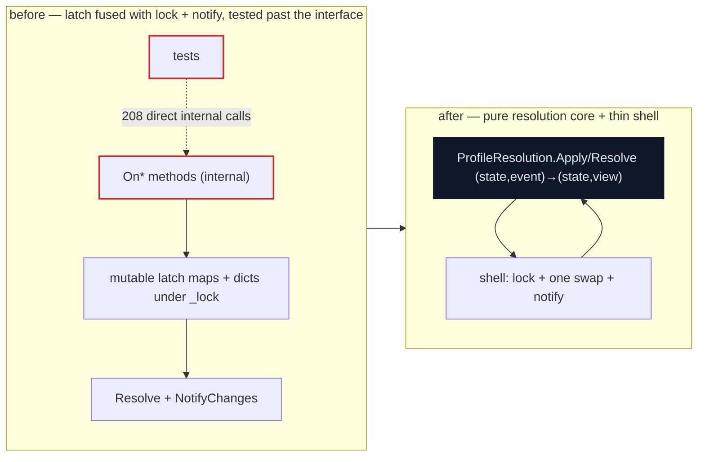
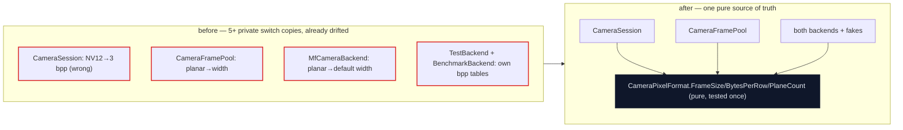
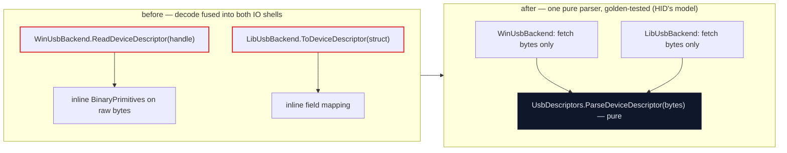
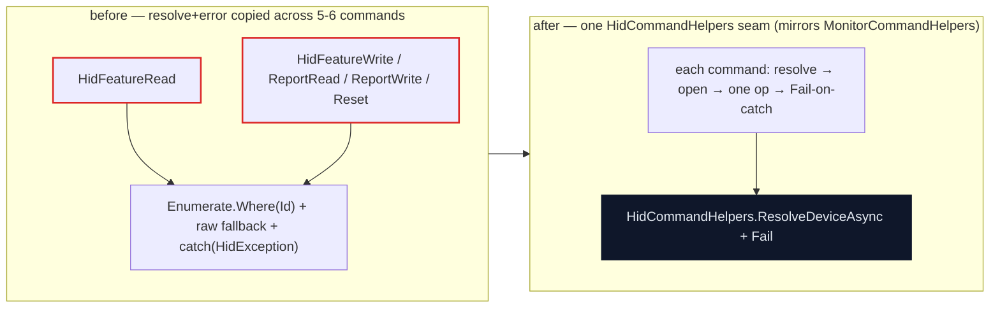

# Periphery architecture deepening review — exploration

**Date:** 2026-06-20
**Status:** Actioned — see the **Outcome** banner below. Authored as an exploratory,
point-in-time survey of deepening opportunities and standards-conformance gaps; the
findings have since been distilled into merged PRs and tracked work-items.
**Method:** Matt Pocock `improve-codebase-architecture` + `codebase-design` skills.
Whole-codebase sweep via **6 parallel reviewers** (one per cluster), each reporting
two axes — **architecture** (turn shallow modules into deep ones) and **standards**
(functional core / imperative shell, strongly-typed IDs, ADR conformance). The
design vocabulary (module / interface / depth / seam / adapter / leverage /
locality / the deletion test) is used deliberately.
**Scope:** the `src/` tree (~42.5k LOC across 25 projects) plus `examples/`,
`tests/` (15 projects), and `benchmarks/`. Excludes `bin/`, `obj/`, `.git/`, and
`scratch/`.

> A companion **visual HTML report** — the same findings with before/after diagrams
> (Tailwind + Mermaid) — lives alongside this file:
> [`architecture-deepening-review-2026-06.html`](architecture-deepening-review-2026-06.html).
> Open it in a browser; it needs network access for the Tailwind + Mermaid CDNs. This
> markdown is the diffable source of record; the HTML is the visual companion.

> **Outcome (2026-06-20).** This review has been actioned. All 10 **Strong** findings —
> plus 1.4 (typed `DeviceId`) and 6.3 (benchmark pixel-math) — were implemented and merged
> to `main` (PRs `#27`, `#28`, `#29`, `#30`, `#31`, `#32`, `#33`, `#35`). The remaining Worth-exploring /
> Speculative findings were filed individually as GitHub issues, one per
> finding, in the range [#112](https://github.com/charles8051/periphery/issues/112)-[#131](https://github.com/charles8051/periphery/issues/131).
> Each is linked from its own heading and from the section tables below, so a
> reader can go from a finding to its work item without leaving this document.
> The sections below are preserved as the original point-in-time survey.

## How to read this

Each finding carries a **strength** — **Strong** (clear, high-leverage),
**Worth exploring** (real, needs a design pass), **Speculative** (latent / future
hardening) — an **axis** (architecture / standards), and a dependency-category tag.
"Before → After" sketches the shallow/fused shape and the deepened one. The skill's
next step is a *grilling* pass on whichever candidate is chosen; nothing here is
decided.

**The verdict up front:** Periphery is a *healthy* codebase that already knows the
functional-core/imperative-shell ideal and applies it well in its newest subsystems.
The Treehopper pure core (ADR-0052) and the firmware-flashing platform (ADR-0061) are
genuine exemplars; Monitor and HID carry textbook pure codecs; the value layer of the
core is immutable and typed. The friction is **concentrated**, not pervasive: two
older state machines at the centre of the device model — `DeviceTracker`'s latch
resolution and `DeviceProxyBase`'s recovery loop — are pure logic fused with their
lock/clock/IO shell and tested *past* the interface, and a handful of seams and
duplicated boilerplate haven't yet been brought up to the bar the repo's own newer
code already hits.

---

## Cross-cutting patterns

Six reviewers, independent lanes, converged on the same handful of shapes:

- **Pure state machines fused with their lock/notification/Task shell, tested *past*
  the interface.** The repo has extracted pure *decision values* (`RecoveryDirective`,
  `ResetStrategy`, `DeviceWaitState`, the FlashAnything `AppReducer`) — but left its two
  biggest *state machines* fused. `DeviceTracker`'s latch/resolve logic is exercised by
  **208 direct calls to its `internal On*` methods**, not its read-only public interface;
  `DeviceProxyBase`'s reconnect/recovery loops tangle the pure decide/delay schedule with
  awaits, reset IO, and a buried clock; `CameraSession`'s producer does the same with its
  timeout/cadence.
- **Buried clocks / non-injectable cadence, beside clock-injectable siblings.**
  `DeviceProxyBase` reads `Environment.TickCount64` in its reopen poll and forces a pure
  backoff curve into an `async` signature it never awaits; `CameraSession` hard-wires
  `Stopwatch` / `new CancellationTokenSource(timeout)` / `Task.Delay` literals. Contrast
  the clean shell-owned cadence done right elsewhere: `I2cDdcMonitorBackend`'s
  `_nextCommandAt` timestamp gate, `DeviceWaitState`, `Apa102Strip`, and the DFU
  `bwPollTimeout` wait.
- **Pure codec / parse logic fused into the IO shell.** USB device-descriptor decode lives
  *inside* both `WinUsbBackend` and `LibUsbBackend` with no pure parser — while HID's
  `HidReportDescriptor.Parse` is the model for exactly this; `MegatecWire` welds frame
  reassembly to its read loop; the CLI's `DeviceInfoTreeBuilder` fuses presentation to
  Spectre. Contrast the clean pure codecs the repo *does* have: `TreehopperWire`,
  `DdcCiWire`, `Efm8Protocol`, `Stm32DfuPlan`, `ElfImage`/`IntelHexImage`.
- **One unfinished typed ID at the centre of the model.** `DeviceInfo.Id` (and
  `ParentId`, `SerialNumber`) is a raw `string` while `HardwareId` / `SerialPortName` /
  `UsbClassCode` are typed record structs. Two reviewers flagged it independently from
  different clusters; it is the entity key threaded through every subsystem.
- **Duplicated shallow boilerplate that fails the deletion test.** Five byte-identical
  per-enricher `EnrichAsync` shells; three structurally-identical `DeviceProxy` leaves;
  the CLI device-resolve + HID-error epilogue copied across 5–6 commands; per-command
  number/byte parsers; `FileLoggerProvider` in triplicate; three first-match registries;
  and the pixel-format dimension math copied across 4+ sites — which has already **drifted**.
- **One purity leak in the exemplar itself.** `TreehopperWire.SpiClockByte` reads
  `Environment.GetEnvironmentVariable("TREEHOPPER_SPI_DANGER_BAND")` on the pure SPI
  encode path — precisely the boundary ADR-0052 says "CI/code-review enforce."

### Healthy grain to defend

- **The Treehopper pure core (ADR-0052)** — the reference for the whole family: closed-union
  `Command`, pure `TreehopperWire.Encode`/`DecodeReport`/`Plan`, immutable
  `BoardReport`/`BoardConfig`, a genuinely thin+deep board shell, deep leases, and an
  immutable `LedFrame` that makes the APA102 torn-frame race unrepresentable.
- **The firmware-flashing platform (ADR-0061)** — the strongest FCIS work after Treehopper:
  `DeviceWaitState` (a pure event-driven wait whose *timeout* is itself a pure signal),
  `Stm32DfuPlan`, `Efm8BootRecordGenerator`, the `AppReducer` + `AutoflashPolicy` folds,
  and the pure image parsers `ElfImage` / `IntelHexImage`.
- **Monitor's four pure cores** (`DdcCiWire`, `OrientationMath`, `LayoutDiff`,
  `MccsCapabilities.Parse`) with shell-owned command cadence, and **HID's** `Codecs/` +
  `HidReportDescriptor.Parse` — the closest matches to the Treehopper bar in the IO tier.
- **The core value layer**: immutable `DeviceInfo`, the typed IDs
  `HardwareId`/`SerialPortName`/`UsbClassCode`, the deep `DeviceFilter.Matches`, the
  hand-written `DeviceInfoDiff.Compute`, and the pure decision values
  `RecoveryDirective`/`ResetStrategy`/`DeviceFaultClassifier`.
- **The deep IO shells done right**: `UsbDevice.RunTransferAsync` (one transfer funnel —
  metering + structured logging + a deadline that becomes a typed `UsbTimeoutException`,
  caller-cancel kept distinct), and the three real provider adapters
  (Windows/Linux/macOS) behind `IDeviceProvider`.
- **The FlashAnything dual-mode host triad** (`Cli.Parse` pure, `DualModeHost` a deep
  one-seam dispatcher, `MainViewModel` thin over the reducer) and the
  `DeviceProvider`/`DeviceMonitorProvider` **contract-test bases** — the repo's one shared
  cross-adapter conformance pattern.

---

## 1. Core device discovery, tracking & reconnect

*`src/Periphery/` — the value layer is exemplary; the two big state machines (tracker resolution, proxy recovery) are the outliers.*

| # | Finding | Axis | Strength |
|---|---------|------|----------|
| 1.1 | Extract `DeviceTracker`'s latch resolution into a pure transition core | standards | **Strong** |
| 1.2 | Make the recovery decide+delay a pure schedule the shell awaits | standards | **Strong** |
| 1.3 | Untangle reset escalation: split the decision from gate+reset+reopen IO | standards | **Strong** |
| 1.4 | Promote `DeviceInfo.Id` to a strongly-typed `DeviceId` struct | standards | Worth exploring |
| [1.5](https://github.com/charles8051/periphery/issues/112) | Collapse the five identical per-enricher `EnrichAsync` shells | architecture | Worth exploring |
| [1.6](https://github.com/charles8051/periphery/issues/113) | Lift the native property read out of `LinuxCategoryMap`'s pure mapping | standards | Worth exploring |

#### 1.1 Extract `DeviceTracker`'s latch resolution into a pure transition core
**Strong · standards · in-process**
**Files:** `src/Periphery/DeviceTracker.cs`, `src/Periphery/MultiDeviceTracker.cs`, `tests/Periphery.Tests/Tracker/DeviceTrackerTests.cs`

**Problem.** The per-profile latch logic (`_presentLatch`/`_connectedLatch`/`_devicesByProfile`
mutations across `OnDeviceAppeared`/`Disappeared`/`Connected`/`Disconnected` plus `Resolve`) is
the load-bearing core, but it is fused with the lock, the mutable fields, and the
`StateChanged`/`IObserver` notification shell. The interface is **not** the test surface:
`DeviceTrackerTests` drives the machine through **208 direct calls** to the `internal On*`
methods, and `MultiDeviceTracker` re-invokes those same internal methods rather than reusing a
value transform.

**Solution.** Lift the latch+resolve logic into an immutable `ProfileResolution`/`TrackerState`
value with total functions `Apply*`/`Resolve : (state, DeviceInfo) → (state, DeviceTrackerState)`.
`DeviceTracker` keeps only the lock, one cell holding the current value, and `NotifyChanges`;
`MultiDeviceTracker`'s children reuse the same value transform.

**Before → After.** Eight mutating `internal` methods each take `_lock`, mutate three dictionaries
+ two latch maps, call `Resolve()`/`CaptureState()`, then `NotifyChanges` — and tests call them
directly because the public `IDeviceTracker` is read-only → a pure resolution value tested by
feeding event sequences and asserting the resulting `DeviceTrackerState`; the class shell shrinks
to lock + one swap + notify.

**Wins:** interface is the test surface · locality of resolution logic · races unrepresentable · matches the ADR-0052 exemplar
**ADR:** No conflict — ADR-0052 sanctions exactly this split; ADR-0049/0029 govern the observer/edge-event shell, which stays.

#### 1.2 Make the recovery decide+delay a pure schedule the shell awaits
**Strong · standards · in-process**
**Files:** `src/Periphery/DeviceProxyBase.cs`, `src/Periphery/ExponentialBackoffRecoveryPolicy.cs`, `src/Periphery/IRecoveryPolicy.cs`

**Problem.** `IRecoveryPolicy.DecideAsync` returns `ValueTask<RecoveryDirective>` and
`ExponentialBackoffRecoveryPolicy` computes a pure `attempt → TimeSpan` curve but is forced into
an async signature that never awaits and ignores its `CancellationToken`. The reconnect and
faulted-node loops then `await` this pure decision, and the reset-reopen poll reads
`Environment.TickCount64` directly (`DeviceProxyBase.cs:805`) — a clock buried in the decision path.

**Solution.** Give the policy a synchronous total signature (`RecoveryDirective Decide(RecoveryContext)`);
the shell owns the single `Task.Delay(directive.Delay)` and the reopen deadline. Keep an async
escape only if a consumer genuinely needs IO in its policy, but the default and the interface
should be pure.

**Before → After.** `public ValueTask<RecoveryDirective> DecideAsync(RecoveryContext, CancellationToken)`
returning `new(new RecoveryDirective.Retry(delay))`; loops do `directive = await _recoveryPolicy.DecideAsync(...)`;
reopen uses `long deadline = Environment.TickCount64 + ...` → a pure `RecoveryDirective Decide(RecoveryContext)`
unit-tested per attempt/budget; the shell awaits the returned `Delay` and owns the monotonic clock.

**Wins:** pure core, no buried clock · total function, fully testable · ct only in the shell
**ADR:** No conflict — ADR-0055 explicitly states the policy must be pure ("State, IO, the clock … live in the proxy, not the policy"); the async signature contradicts the ADR's own stated intent.

#### 1.3 Untangle reset escalation: split the decision from gate+reset+reopen IO
**Strong · standards · ports & adapters**
**Files:** `src/Periphery/DeviceProxyBase.cs`, `src/Periphery/IResetSafetyGate.cs`, `src/Periphery/IDeviceReset.cs`, `src/Periphery/ResetStrategyMap.cs`

**Problem.** `TryResetAndReopenAsync` fuses four concerns into one async method: the safety-gate
consult (`CanResetAsync`), the reset IO (`ResetAsync`), a clock-driven self-reopen poll loop, and
the state transitions. The escalation *decision* (which strategy, whether the reset budget is
spent) is not separable from the IO, so the only way to test the escalation ladder is through the
full async proxy with fakes — while `ResetStrategyMap` and `RecoveryContext.AvailableResets` are
already pure.

**Solution.** Let the policy choose the strategy from the (pure) `RecoveryContext`; move the gate
call, reset call, and reopen poll into a thin shell method that takes the chosen strategy and just
executes. The gate (`IResetSafetyGate.CanResetAsync`) is a real port across a boundary — leave it
async — but the decision of whether to *ask* it is pure.

**Before → After.** `TryResetAndReopenAsync` awaits `CanResetAsync`, `Task.Delay` on denial, awaits
`ResetAsync`, then a `while (TickCount64 < deadline)` reopen poll — decision, gate IO, reset IO and
clock all in one body → a pure escalation step picks the strategy/gives up from `RecoveryContext`;
an effectful `ExecuteResetAsync(strategy)` owns gate+reset+reopen. The ladder is asserted as values.

**Wins:** decision split from IO · escalation testable as values · gate stays a real port · locality of reset policy
**ADR:** No conflict — ADR-0060 sanctions the escalation; this only relocates the pure decision out of the IO body.

#### 1.4 Promote `DeviceInfo.Id` to a strongly-typed `DeviceId` struct
**Worth exploring · standards · cleanup**
**Files:** `src/Periphery/DeviceId.cs`, `src/Periphery/DeviceInfo.cs`, `src/Periphery/DeviceTracker.cs`

**Problem.** `DeviceInfo.Id`, `ParentId`, and `SerialNumber` are raw `string` while
`VendorId`/`ProductId`/`PortName`/`UsbClassCode` are typed. The case-insensitive identity
invariant lives in a separate `DeviceId` *helper* (`static` `Comparer`/`Equals`), so every keyer
must remember to route through it by convention — the type system does not enforce it, and a plain
string compare silently reintroduces the phantom-duplicate bug the helper's own doc-comment warns
about. This is the entity key threaded through **every** subsystem (HID, USB, monitor, camera,
treehopper); two reviewers flagged it independently.

**Solution.** Make `DeviceId` a `readonly record struct` wrapping the string with built-in
`OrdinalIgnoreCase` equality (mirroring `HardwareId`/`SerialPortName`), so `DeviceInfo.Id : DeviceId`
and the invariant is carried by the value, not by remembering the comparer.

**Before → After.** `internal static class DeviceId { … Comparer; … Equals(string?,string?) }` +
`public required string Id { get; init; }`, with dictionaries built as `new(DeviceId.Comparer)` and
inline `DeviceId.Equals(...)` scattered through the tracker → `public readonly record struct DeviceId(string Value)`
with case-insensitive `Equals`/`GetHashCode`; identity comparisons are just `==`.

**Wins:** invariant carried by the type · raw strings can't leak as ids · consistency with the other typed IDs
**ADR:** Cross-cutting core-model change (flows through every subsystem) — decide at the core level; the camera/IO clusters consume it.

#### 1.5 Collapse the five identical per-enricher `EnrichAsync` shells

_Tracked as [#112](https://github.com/charles8051/periphery/issues/112)._
**Worth exploring · architecture · in-process**
**Files:** `src/Periphery/SensorEnricher.cs`, `src/Periphery/ImagingEnricher.cs`, `src/Periphery/PrinterEnricher.cs`, `src/Periphery/BiometricEnricher.cs`, `src/Periphery/SmartCardEnricher.cs`, `src/Periphery/ITagEmittingEnricher.cs`

**Problem.** Each tag-emitting enricher's real content is a pure `CanEnrich` predicate, but every
one repeats a byte-identical `EnrichAsync` shell:
`if (!CanEnrich(device) || device.Tags.Contains(tag)) return Task.FromResult(device); return Task.FromResult(device with { Tags = device.Tags.Add(tag) });`.
The `Task.FromResult` wrapping fuses the pure tag-decision with an async shape five times over.
Deletion test: delete any enricher's `EnrichAsync` and the complexity reappears verbatim in the
next — it is a pass-through.

**Solution.** Have `ITagEmittingEnricher` carry only the pure pieces (`EmitsTags` + a pure
`bool CanEnrich`); let the pipeline apply the tag for every `CanEnrich`-true tagger. Enrichers
shrink to a predicate + their tag/scope constants.

**Before → After.** Five sealed classes each implementing the same 5-line `EnrichAsync` over
`Task.FromResult`, differing only in the tag constant → a pure `CanEnrich` predicate per enricher;
the pipeline owns the single tag-application transform.

**Wins:** passes the deletion test · pure decision, no `Task` in core · one tag-apply site
**ADR:** No conflict — ADR-0026/0051 govern the zero-IO/tag-demotion contract, which this preserves while removing the redundant async surface.

#### 1.6 Lift the native property read out of `LinuxCategoryMap`'s pure mapping

_Tracked as [#113](https://github.com/charles8051/periphery/issues/113)._
**Worth exploring · standards · in-process**
**Files:** `src/Periphery/Linux/LinuxCategoryMap.cs`, `src/Periphery/Linux/LinuxDeviceProvider.cs`

**Problem.** `LinuxCategoryMap` is otherwise a pure lookup, but `ResolveCategory(string? subsystem, IntPtr device)`
takes a native udev handle and `ResolveInputCategory` calls `UdevInterop.GetPropertyValue(device, …)` —
a P/Invoke buried inside the one category map that should be the pure core. Unlike the Windows/macOS
maps (pure over already-read values), the Linux map cannot be unit-tested through its interface
without a live udev pointer, which is why it has no category-map test while macOS does.

**Solution.** Read `ID_INPUT_KEYBOARD`/`ID_INPUT_MOUSE` in the provider's IO shell (where the dev
handle already lives) and pass the two booleans into a pure `ResolveCategory(subsystem, isKeyboard, isMouse)`.

**Before → After.** `ResolveCategory(subsystem, IntPtr device)` → `ResolveInputCategory(IntPtr)` →
`UdevInterop.GetPropertyValue(...)` inside the map → `ResolveCategory(subsystem, bool isKeyboard, bool isMouse)`,
a total function over values; the single property read moves to `LinuxDeviceProvider.ToDeviceInfo`.

**Wins:** category map is pure · testable through its interface · parity with Win/macOS maps
**ADR:** No conflict — ADR-0010 governs the udev provider shell, not the purity of the map.

---

## 2. Camera capture

*`src/Periphery.Camera/` (+ `.Avalonia`) — among the strongest clusters: `ICameraBackend` is a deep two-adapter seam and the value/lease layer is exemplary. Friction is duplicated dimension math and a non-injectable producer clock.*

| # | Finding | Axis | Strength |
|---|---------|------|----------|
| 2.1 | Hang pixel-format dimension math on `CameraPixelFormat` (4 copies, drifted) | architecture | **Strong** |
| 2.2 | Make `CameraSession`'s producer-loop timeout/cadence clock-injectable | standards | **Strong** |
| 2.3 | `DropLateFrames` is a dead seam — wire it or delete it | architecture | **Strong** |
| [2.4](https://github.com/charles8051/periphery/issues/114) | Give `MfFormatMap` the direct test its V4L2 twin already has | architecture | Worth exploring |
| [2.5](https://github.com/charles8051/periphery/issues/115) | Share the bounded-cleanup shell primitive instead of three copies | standards | Speculative |

#### 2.1 Hang pixel-format dimension math on `CameraPixelFormat` (4 copies, drifted)
**Strong · architecture · in-process**
**Files:** `src/Periphery.Camera/CameraPixelFormat.cs`, `src/Periphery.Camera/CameraSession.cs`, `src/Periphery.Camera/Internal/CameraFramePool.cs`, `src/Periphery.Camera/Windows/MfCameraBackend.cs`, `src/Periphery.Camera/Internal/PlaneLayout.cs`

**Problem.** Bytes-per-pixel, row-stride, frame-size, and plane-count are each computed by ad-hoc
per-format `switch` expressions copy-pasted across the cluster: `CameraSession.EstimateFrameSize`,
`CameraFramePool.EstimateStride`, `MfCameraBackend.EstimateStride`/`.ComputeFrameSize`/`.GetPlaneCount`,
plus the test and benchmark backends each carry their own bpp table. These are the same domain facts
about `CameraPixelFormat` expressed five-plus times, and they have **already drifted**:
`CameraSession.EstimateFrameSize` maps NV12/NV21 → `3` bpp (`CameraSession.cs:584`) when the true cost
is 1.5 bytes/px, double-allocating the pool seed; `CameraFramePool.EstimateStride` lists the planar
formats explicitly (`CameraFramePool.cs:127`) while `MfCameraBackend.EstimateStride` lets them fall
through `_ => width`. A new pixel format (or a stride fix) must be threaded through every copy by hand.

**Solution.** Hang the dimension math on `CameraPixelFormat` (or extend `PlaneLayout`, which is already
the right shape — pure, format-keyed, directly tested) as pure static functions —
`BitsPerPixel()`/`BytesPerRow(width)`/`FrameSize(width,height,stride)`/`PlaneCount()` — and have every
call site delegate. Delete the four private switch copies; the fakes then exercise the same pure
functions as production.

**Wins:** single source of truth · kills the NV12 drift · pure + tested once · deep module
**ADR:** No conflict.

#### 2.2 Make `CameraSession`'s producer-loop timeout/cadence clock-injectable
**Strong · standards · in-process**
**Files:** `src/Periphery.Camera/CameraSession.cs`

**Problem.** `CameraSession` is the cluster's imperative shell (it rightly owns the channel, the
`LongRunning` producer thread, and disposal), but it fuses the timing policy into that shell instead
of expressing cadence as pure state advanced by a shell-owned clock. Frame-timeout is
`new CancellationTokenSource(timeout.Value)`; the producer measures with `Stopwatch.StartNew()`; the
bounded-stop guards are `Task.Delay(TimeSpan.FromSeconds(2))`/`(3)` literals. None take an injected
clock — so `CameraDiagnosticsTests`/`DeviceLossTests` must `await Task.Delay(200)` real ms, and the
timeout-vs-cancellation decision (subtle — it must distinguish user-cancel from timeout-expiry and
surface `CameraTimeoutException` only for the latter) is effectively untested for the expiry branch.

**Solution.** Inject `TimeProvider` and route every timeout/delay/elapsed through it
(`CreateTimer`/`GetTimestamp`); keep the timeout-vs-cancelled-vs-faulted decision as a pure helper
over the resulting signals so a `FakeTimeProvider` can advance virtual time and assert
`CameraTimeoutException` without sleeping — the same split the Treehopper pure core uses.

**Before → After.** `using var timeoutCts = new CancellationTokenSource(timeout.Value); var sw = Stopwatch.StartNew(); await Task.WhenAny(producerTask, Task.Delay(2s));`
→ ctor takes `TimeProvider`; `FakeTimeProvider.Advance(timeout)` drives the expiry branch deterministically.

**Wins:** shell-owned clock · deterministic timeout test · test the interface · core/shell split
**ADR:** No conflict.

#### 2.3 `DropLateFrames` is a dead seam — wire it or delete it
**Strong · architecture · cleanup**
**Files:** `src/Periphery.Camera/CameraConfiguration.cs`, `src/Periphery.Camera/CameraSessionBuilder.cs`

**Problem.** `CameraConfiguration.DropLateFrames` (default `true`) and
`CameraSessionBuilder.DropLateFrames(bool)` advertise a late-frame back-pressure switch (the builder
doc says "pass false to back-pressure the producer instead"). But the value is only ever declared
(`CameraConfiguration.cs:10`), set (`CameraSessionBuilder.cs:139`), and asserted to round-trip in a
test — **nothing in `CameraSession` or the producer ever reads it.** The actual drop/block behaviour
is driven entirely by the orthogonal `BufferExhaustionPolicy`. It is a leaky seam that advertises a
behaviour alteration that does not happen, with a test that gives false confidence by checking
plumbing rather than effect; it fails the deletion test (delete it and zero behaviour changes).

**Solution.** Either wire `DropLateFrames` into the producer (most naturally: have it select the
default `BufferExhaustionPolicy` when the caller hasn't set one — `false` ⇒ `BlockProducer`, `true`
⇒ `DropIncoming`) and test the runtime effect, or delete the property + builder method + plumbing-only
test outright and let `BufferExhaustionPolicy` be the single late-frame knob. Given Periphery's
no-consumers/"make it right" stance, deletion is the cleaner move unless the two-knob ergonomic is
deliberate.

**Before → After.** `builder.DropLateFrames(false)` → config flag asserted by a test → producer
ignores it; drops governed only by `BufferExhaustionPolicy` → the flag either resolves to a
`BufferExhaustionPolicy` in the producer (effect tested) or is gone.

**Wins:** deletion test · kills a leaky seam · test the effect, not the plumbing
**ADR:** No conflict.

#### 2.4 Give `MfFormatMap` the direct test its V4L2 twin already has

_Tracked as [#114](https://github.com/charles8051/periphery/issues/114)._
**Worth exploring · architecture · in-process**
**Files:** `src/Periphery.Camera/Windows/MfFormatMap.cs`, `tests/Periphery.Camera.Tests/V4l2FormatMapTests.cs`

**Problem.** `MfFormatMap` is pure, total, bidirectional logic (GUID↔`CameraPixelFormat`,
control-kind↔property-id) — exactly the kind of thing that should be tested through its own interface
independent of the OS. Its Linux counterpart `V4l2FormatMap` *is* tested directly. But there is no
`MfFormatMapTests`: the MF map is exercised only transitively through `MfCameraBackend`, which needs a
real Windows camera, so its round-trip invariants (every format maps back; the deliberate
RGB24→Bgr24 / RGB32→Bgra32 asymmetry; no two kinds collide on a property id) are unverified on CI Linux
and unverified at all without hardware.

**Solution.** Add `MfFormatMapTests` mirroring `V4l2FormatMapTests`: assert the round-trips, the
deliberate asymmetric mappings, and `TryGetPropertyId` totality with no collisions. `MfFormatMap`
touches no MF API, so its logic is platform-neutral and the test runs everywhere.

**Before → After.** V4L2 map: direct tests on CI. MF map: tested only via the backend on real Windows
hardware → both maps have direct round-trip/totality/no-collision tests as the test surface.

**Wins:** interface is the test surface · pure + tested · symmetry with V4L2
**ADR:** No conflict.

#### 2.5 Share the bounded-cleanup shell primitive instead of three copies

_Tracked as [#115](https://github.com/charles8051/periphery/issues/115)._
**Speculative · standards · in-process**
**Files:** `src/Periphery.Camera/CameraSession.cs`, `src/Periphery.Camera/Windows/MfCameraBackend.cs`

**Problem.** The "run a wedge-prone native cleanup on a background task with a hard timeout,
warn-and-abandon if it overruns" pattern appears three times with three different literal timeouts and
near-identical `Console.Error` warnings: `CameraSession.RunBoundedAsync` (2 s), `StopProducerAsync`'s
`Task.WhenAny(producerTask, Task.Delay(2s))`, and `MfCameraBackend.DisposeAsync`'s
`Task.WhenAny(cleanupTask, Task.Delay(3s))`. Shell timing concern, copy-implemented rather than factored.

**Solution.** Extract one internal `BoundedShellOp.RunOrAbandon(Func<Task> work, TimeSpan budget, string label, TimeProvider clock)`
(folding in the `TimeProvider` from 2.2) and have the session and backends call it. This also gives one
place to replace `Console.Error.WriteLine` with the structured logger the rest of the cluster uses.

**Before → After.** Three copies, three literals, three `Console.Error` warnings → one
`RunOrAbandon(work, budget, label, clock)` shared by session and backends; warnings routed through the logger.

**Wins:** shell primitive · timing in one place · structured logging
**ADR:** No conflict.

---

## 3. Device IO extensions — HID / Monitor / USB

*`src/Periphery.Hid`, `src/Periphery.Monitor`, `src/Periphery.Usb` — each is a clean two-adapter (Windows+Linux) backend seam. Monitor and HID match the Treehopper pure-core bar; USB has the one real codec-in-the-shell divergence.*

| # | Finding | Axis | Strength |
|---|---------|------|----------|
| 3.1 | Extract a pure USB descriptor parser out of both backends | standards | **Strong** |
| [3.2](https://github.com/charles8051/periphery/issues/116) | Make `MegatecWire`'s reassembly a pure incremental parser (or rename it honestly) | standards | Worth exploring |
| [3.3](https://github.com/charles8051/periphery/issues/117) | Move DDC/CI timing constants out of the pure codec into the shell | standards | Worth exploring |
| [3.4](https://github.com/charles8051/periphery/issues/118) | Hoist the three identical `DeviceProxy` factory bodies into the base | architecture | Worth exploring |
| [3.5](https://github.com/charles8051/periphery/issues/119) | Make `WinUsbBackend.ClaimInterface`'s platform ceiling an honest seam | architecture | Speculative |
| 3.6 | Reference grain — Monitor's pure cores + `UsbDevice`'s transfer funnel (defend) | standards | Speculative |

#### 3.1 Extract a pure USB descriptor parser out of both backends
**Strong · standards · in-process**
**Files:** `src/Periphery.Usb/Windows/WinUsbBackend.cs`, `src/Periphery.Usb/Linux/LibUsbBackend.cs`, `src/Periphery.Usb/UsbDeviceDescriptor.cs`

**Problem.** The 18-byte standard USB device-descriptor layout is fixed by the spec and
platform-independent, yet `WinUsbBackend.ReadDeviceDescriptor` byte-decodes it inline
(`BinaryPrimitives.ReadUInt16LittleEndian(buffer.AsSpan(2))`, `buffer[4]`, … — `WinUsbBackend.cs:321`)
inside a static method that takes a `winUsbHandle`, and `LibUsbBackend.ToDeviceDescriptor` transforms
libusb structs inline. This is pure decode logic wedged into the IO shell. HID solved the identical
problem the right way: `HidReportDescriptor.Parse(ReadOnlySpan<byte>)` is a pure total function with
golden-descriptor tests. USB has no analogue — so the decode that ships is reachable only on real
hardware, while `UsbDeviceTests` hands the device a canned descriptor record via the fake.

**Solution.** Extract a pure `UsbDescriptors` static class —
`ParseDeviceDescriptor(ReadOnlySpan<byte>) → UsbDeviceDescriptor` and
`ParseConfiguration(ReadOnlySpan<byte>) → UsbConfigurationDescriptor` (the latter also unblocks the
multi-interface/alt-setting parsing both backends currently TODO away). The backends keep the raw-byte
fetch then call the parser; add golden-vector tests mirroring `HidReportDescriptorTests`.

**Wins:** pure core · interface is the test surface · matches the HID exemplar
**ADR:** No conflict.

#### 3.2 Make `MegatecWire`'s reassembly a pure incremental parser (or rename it honestly)

_Tracked as [#116](https://github.com/charles8051/periphery/issues/116)._
**Worth exploring · standards · cleanup**
**Files:** `src/Periphery.Hid/Codecs/MegatecWire.cs`, `src/Periphery.Hid/Codecs/MegatecQxCodec.cs`

**Problem.** `MegatecQxCodec`'s doc calls `MegatecWire` "the wire" and `MegatecStatus.Parse` "the pure
total function", implying a codec(wire)+parse(pure) split. But `MegatecWire.RequestAsync` takes a live
`HidDevice` and does `WriteReportAsync`/`ReadReportAsync` plus owns a `CancellationTokenSource.CancelAfter` —
it is the IO shell, not a wire codec. The actual pure framing decision (skip-noise-until-prefix,
accumulate-until-CR) is good total logic but welded to the read loop, so it can't be unit-tested on a
byte buffer the way Monitor's `DdcCiWire.TryDecodeGetVcpReply` can.

**Solution.** Either (a) reframe `MegatecWire` honestly as the Megatec transport *shell* and stop
describing it as the pure layer, or (b) extract the noise-skip + prefix/CR reassembly into a pure
`MegatecFrame.Feed(ref state, span, out line)` the shell drives, closing the one untested codec path
in HID. (b) is the deepening.

**Before → After.** Pure reassembly fused to the `while (!deadline) { await ReadReportAsync(); for(...) }`
read loop → shell reads; pure `MegatecFrame.Feed` decides, span-testable with no device, no clock.

**Wins:** pure core · interface is the test surface · honest doc
**ADR:** No conflict.

#### 3.3 Move DDC/CI timing constants out of the pure codec into the shell

_Tracked as [#117](https://github.com/charles8051/periphery/issues/117)._
**Worth exploring · standards · cleanup**
**Files:** `src/Periphery.Monitor/DdcCiWire.cs`, `src/Periphery.Monitor/Linux/I2cDdcMonitorBackend.cs`

**Problem.** `DdcCiWire` is otherwise a textbook pure frame codec, but it also declares
`CommandSpacing = 50ms` and `ReplyDelay = 40ms` as `static readonly TimeSpan` members. Those are
shell timing policy, not part of the wire format — the codec never uses them; only
`I2cDdcMonitorBackend` reads them. Not a hard FCIS violation (const data, no sleep in the codec, and
the shell already advances cadence as pure timestamp phase via `_nextCommandAt` — that part is
exemplary), but it blurs the "pure values + total functions" boundary the file's own doc claims ("the
backend owns … the mandatory inter-command delays").

**Solution.** Move `CommandSpacing`/`ReplyDelay` onto `I2cDdcMonitorBackend` (or a `DdcTiming` policy
record the shell holds), so `DdcCiWire` is exclusively `Encode*`/`TryDecode*`/`Checksum` + address
constants.

**Before → After.** `DdcCiWire` holds the two `TimeSpan` delays → the shell that owns the clock holds them.

**Wins:** pure core · locality · doc matches code
**ADR:** No conflict.

#### 3.4 Hoist the three identical `DeviceProxy` factory bodies into the base

_Tracked as [#118](https://github.com/charles8051/periphery/issues/118)._
**Worth exploring · architecture · in-process**
**Files:** `src/Periphery.Usb/UsbDeviceProxy.cs`, `src/Periphery.Hid/HidDeviceProxy.cs`, `src/Periphery.Monitor/MonitorDeviceProxy.cs`

**Problem.** `UsbDeviceProxy`, `HidDeviceProxy`, and `MonitorDeviceProxy` are structural copies: two
private base-forwarding ctors, one `OpenDeviceAsync` override (the only real per-type behaviour), and
the same two static factories (`OpenAsync(profile, recoveryPolicy, ct)` that news a `DeviceTracker` +
`Devices.Watch().AddTracker` + start-or-dispose; `Create(tracker, recoveryPolicy)`). Each individually
*passes* the deletion test — `DeviceProxyBase` holds the reconnect state machine and the override is
real — so this is not a wrapper to delete, but ~40 lines × 3 of identical factory plumbing means a fix
to the start-or-dispose handshake must be made in three places, and the next backend (Serial, ADR-0062)
will paste a fourth copy.

**Solution.** Lift the two factory bodies into `DeviceProxyBase` as generic statics
(`StartAsync<TProxy>(profile, rp, factory, ct)` / `Create<TProxy>`), so each leaf shrinks to its
`OpenDeviceAsync` override + thin factory shims. (`DeviceProxyBase` is in core — coordinate as a core change.)

**Before → After.** The same ~40-line `OpenAsync`/`Create` bodies in all three leaves → one maintained
base implementation; leaves keep only their override.

**Wins:** locality · deep base seam · less boilerplate
**ADR:** ADR-0062 (serial-backend-provider) — the next leaf; fixing now avoids a 4th copy.

#### 3.5 Make `WinUsbBackend.ClaimInterface`'s platform ceiling an honest seam

_Tracked as [#119](https://github.com/charles8051/periphery/issues/119)._
**Speculative · architecture · in-process**
**Files:** `src/Periphery.Usb/Windows/WinUsbBackend.cs`, `src/Periphery.Usb/IUsbBackend.cs`, `src/Periphery.Usb/UsbDevice.cs`

**Problem.** `IUsbBackend.ClaimInterface(byte)` and the public `UsbDevice.ClaimInterface(byte)`
advertise a general multi-interface claim, but the Windows adapter throws `NotSupportedException` for
any `interfaceNumber != 0` ("WinUSB spike supports interface 0 only … not yet wired up"), while the
Linux adapter claims arbitrary interfaces. The same public call succeeds on Linux and throws on Windows
for interface 1+ — a platform-capability asymmetry the interface contract hides, with no
`SupportsInterface` flag the caller can check (contrast `MonitorDevice`, which exposes
`SupportsVcp`/`SupportsDisplayMode` precisely so callers branch before hitting an absent plane).

**Solution.** Either finish the Windows path (`WinUsb_GetAssociatedInterface`) so the contract holds on
both adapters, or — until then — make the limitation visible: document interface 0 as the only
cross-platform-guaranteed claim, and surface a claimable-interface count so a multi-interface consumer
detects the ceiling without catching `NotSupportedException`.

**Before → After.** `ClaimInterface(1)` throws on Windows, succeeds on Linux, undiscoverable until
runtime → the contract holds on both adapters, or the ceiling is a queryable capability.

**Wins:** honest seam · no platform leak
**ADR:** ADR-0038 documents the interface-0 spike scope; revisit when a multi-interface consumer appears.

#### 3.6 Reference grain — Monitor's pure cores + `UsbDevice`'s transfer funnel (defend)
**Speculative · standards**
**Files:** `src/Periphery.Monitor/DdcCiWire.cs`, `src/Periphery.Monitor/OrientationMath.cs`, `src/Periphery.Monitor/MonitorLayout.cs`, `src/Periphery.Usb/UsbDevice.cs`

**Problem.** Not a defect — modules worth naming so a future refactor doesn't dissolve them. Monitor
carries four pure cores (`DdcCiWire` frame codec, `OrientationMath` rotation, `LayoutDiff`
desired-vs-current, `MccsCapabilities.Parse`), each tested directly *and* consumed at real call sites,
with the I2C shell advancing command spacing as pure timestamp phase — the closest match to the
Treehopper bar in the IO tier. `UsbDevice.RunTransferAsync` is the positive control for a *deep shell*:
one funnel every transfer flows through, fusing metering + structured logging + a per-transfer deadline
that becomes a typed `UsbTimeoutException` while keeping caller cancellation distinct — `Stopwatch`/`CTS`
live here correctly (imperative shell), tested through the interface by the watchdog tests.

**Solution.** Defend as-is. Treat "every new transfer routes through the funnel" as an invariant, and
judge new IO-tier codecs against Monitor's pure-core split rather than re-fusing decode into the handle.

**Wins:** exemplar to defend · pure codecs tested directly · one timing/metering site
**ADR:** No conflict.

---

## 4. Treehopper — the pure-core exemplar (ADR-0052)

*`src/Periphery.Treehopper` (+ Control / Libraries) — the healthiest cluster in the repo, and the reference grain for everything above. The core honours ADR-0052's hard rules with exactly one leak; the leases are deep handles; the LED library is the immutable-frame model; the satellites match the grain.*

| # | Finding | Axis | Strength |
|---|---------|------|----------|
| 4.1 | Move the SPI danger-band env read out of the pure codec into the shell | standards | **Strong** |
| [4.2](https://github.com/charles8051/periphery/issues/120) | Make `BoardReport` self-describing (Adc noise on digital pins) | architecture | Worth exploring |
| 4.3 | Reference grain — pure core, deep leases, immutable LED frame (defend) | standards | Speculative |

#### 4.1 Move the SPI danger-band env read out of the pure codec into the shell
**Strong · standards · in-process**
**Files:** `src/Periphery.Treehopper/Wire/TreehopperWire.cs`

**Problem.** `SpiClockByte(double)` calls
`Environment.GetEnvironmentVariable("TREEHOPPER_SPI_DANGER_BAND")` (`TreehopperWire.cs:455`). It is
invoked by `SpiTransactionBytes`, which `Encode` calls for every `Command.SpiTransaction`. So `Encode`
— the δ of the wire transducer that ADR-0052 DEC-001 declares "Pure: same input, same bytes, no side
effects", and which the ADR's "What we constrain" section says "touch no clock … CI/code-review enforce
this boundary" — is in fact non-deterministic: the same `Command` can encode to different bytes
depending on ambient process state, and each SPI transfer does a `GetEnvironmentVariable` syscall. The
intent is legitimate (a deliberate debug-only opt-in bypass of the host clock clamp, per
`docs/explorations/treehopper-spi-usb-lockup.md`), but the placement inside the pure core is precisely
the leak the ADR's enforcement clause exists to prevent.

**Solution.** Lift the danger-band decision into the imperative shell: thread a `bool allowDangerBand`
through `SpiClockByte`/`SpiTransactionBytes`/`Encode`'s SPI path, with `TreehopperBoard` reading the env
var **once** at construction (or carrying the flag on the `Command.SpiTransaction` value). `SpiClockByte`
stays total and deterministic; the bypass survives as a shell-owned concern; CI can then assert "no
`Environment`/`DateTime`/`Task` in `Wire/`".

**Before → After.** `SpiClockByte(double)` reads the env var inline on the encode hot path →
`SpiClockByte(double, bool allowDangerBand = false)`, a total function; the shell reads the env var once
and threads the flag in.

**Wins:** restores the deterministic pure core · moves ambient state to the shell · honours DEC-001's hard rule
**ADR:** ADR-0052's "What we constrain" forbids exactly this; worth a one-line note in the SPI-lockup investigation that the bypass moved to the shell, rather than reopening the ADR.

#### 4.2 Make `BoardReport` self-describing (Adc noise on digital pins)

_Tracked as [#120](https://github.com/charles8051/periphery/issues/120)._
**Worth exploring · architecture · in-process**
**Files:** `src/Periphery.Treehopper/Wire/TreehopperWire.cs`, `src/Periphery.Treehopper/BoardReport.cs`

**Problem.** `DecodeReport` sets every `PinSnapshot` to *both* `Digital: high != 0` and
`Adc: (high << 8) | low`, for all pins regardless of mode (the report carries no mode). But
`BoardReport`/`PinSnapshot` carry no mode either, so a caller holding only a `BoardReport` — the
documented primary DEC-002 API — cannot tell which projection is valid. `PinSnapshot.Adc`'s own doc says
"0 for other modes", which `DecodeReport` does **not** honour: a digital-input pin reading high decodes
`Adc` to a large bogus number, and `AnalogValue`/`AnalogVoltage` return a garbage voltage. The leases
paper over it (they remember the mode), but the standalone value is ambiguous.

**Solution.** Decide where mode lives. Cheapest: fix `PinSnapshot.Adc`'s doc to state it is the raw
12-bit field, meaningful only in `AnalogInput` mode (so `AnalogValue`/`AnalogVoltage` are explicitly
caller-asserts-mode). Better, if `BoardReport` is to be a standalone observable: fold the per-pin mode
into the snapshot at publish time (the shell knows `_applied`), so the report is self-describing.

**Before → After.** `new PinSnapshot(Digital: high != 0, Adc: (high << 8) | low)` — both projections,
always populated → either a doc fix making Adc analog-only, or a shell-stamped mode so the report is
self-describing.

**Wins:** report is self-describing · no bogus ADC on digital pins · matches the interface contract
**ADR:** No conflict.

#### 4.3 Reference grain — pure core, deep leases, immutable LED frame (defend)
**Speculative · standards**
**Files:** `src/Periphery.Treehopper/Wire/Command.cs`, `src/Periphery.Treehopper/Wire/TreehopperWire.cs`, `src/Periphery.Treehopper/TreehopperBoard.cs`, `src/Periphery.Treehopper/I2cLease.cs`, `src/Periphery.Treehopper.Libraries/LedFrame.cs`

**Problem.** Not a defect — the grain to judge the rest of the repo against. Verified against ADR-0052's
hard rules: `Wire/Command.cs` is a closed union (private-protected ctor → exhaustive `Encode`);
`TreehopperWire.Encode`/`DecodeReport`/`Plan` are pure total functions with no clock, no `Task`, no
`CancellationToken`, no `IUsbBulkChannel`, no retained mutable buffers (the one exception is 4.1). The
shell (`TreehopperBoard`) is genuinely thin+deep: `ReconcileCoreAsync` is update→`Plan`→`Encode`→ship→
advance-`_applied` under one `SemaphoreSlim`; the producer is read→`DecodeReport`→publish to bounded
channels (no shared mutable pin field — DEC-002's race dissolved). The leases are *deep handles*, not
forwarders (I²C status-decode + typed throw, OneWire MATCH-ROM framing, SPI burst mapping). DEC-005 is
exemplary: `LedFrame`/`Rgb` immutable, `LedAnimation` a closed union with pure `Next()`/`Render()`,
`Apa102Strip` the shell owning `Task.Delay` + the SPI handle and snapshotting the frame before transfer
— the torn-frame race is unrepresentable. DEC-004 holds by construction (PWM cadence is firmware-driven;
no host tick to bury a sleep in). The board is tested through its interface against a real `FakeUsbBackend`.

**Solution.** Defend all of it. The one open coverage gap: the background producer loop
(`ProduceReportsAsync`) is bypassed by `CreateForTest` — optionally drive it over a scripted
`FakeUsbBackend.BulkReadAsync` to cover decode→publish→fan-out through `Reports`.

**Wins:** the reference grain · interface is the test surface · cadence in the shell · immutable frames
**ADR:** No conflict — this *is* ADR-0052, implemented.

---

## 5. Firmware flashing & bootloaders (ADR-0061)

*`src/Periphery.Bootloader*`, `Periphery.Firmware`, `Periphery.FlashAnything*`, `Periphery.Treehopper.Firmware`/`.Flasher` — the strongest FCIS subsystem after Treehopper: pure plans/parsers/reducers, transports as real two-adapter seams, clock-injectable waits. Findings are refinements, not violations.*

| # | Finding | Axis | Strength |
|---|---------|------|----------|
| [5.1](https://github.com/charles8051/periphery/issues/121) | Core the DFU GETSTATUS poll as a pure reaction the shell interprets | standards | Worth exploring |
| [5.2](https://github.com/charles8051/periphery/issues/122) | Model DFU verify read-back in the pure plan, like the write path | architecture | Worth exploring |
| [5.3](https://github.com/charles8051/periphery/issues/123) | Collapse the second Treehopper flash path the ADR already flags for deletion | architecture | Worth exploring |
| [5.4](https://github.com/charles8051/periphery/issues/124) | Trim `DeviceIdentity`'s always-empty `Chip`/`Regions` fields | architecture | Speculative |
| [5.5](https://github.com/charles8051/periphery/issues/125) | Make the EFM8 flash-map a value, ready for the family core | architecture | Speculative |
| [5.6](https://github.com/charles8051/periphery/issues/126) | Fold the three first-match registries into one generic seam | architecture | Speculative |

#### 5.1 Core the DFU GETSTATUS poll as a pure reaction the shell interprets

_Tracked as [#121](https://github.com/charles8051/periphery/issues/121)._
**Worth exploring · standards · in-process**
**Files:** `src/Periphery.Bootloader.Stm32.Usb/Stm32DfuProgrammer.cs`, `src/Periphery.Bootloader.Stm32.Usb/DfuStatus.cs`, `src/Periphery.Bootloader.Stm32.Usb/Stm32DfuPlan.cs`

**Problem.** The DFU `DNLOAD → GETSTATUS(dfuDNBUSY) → wait bwPollTimeout → GETSTATUS(confirm/error)`
handshake — the most behaviourally load-bearing sequence in AN3156 — lives only as imperative control
flow in `DownloadAndWaitAsync`/`EnsureIdleAsync`. The *timing* is correctly in the shell
(`Task.Delay(busy.PollTimeout)` with the device dictating the value), but the *decision* (busy? error?
idle? how many recover attempts remain? next action?) is fused into the async body rather than a pure
transition over `DfuStatus`, the way `DeviceWaitState` cores its own wait. So the errTARGET/errVENDOR/
recovery-ladder table is only reachable through a real `Task.Delay` against `FakeStm32DfuTransport`.

**Solution.** Extract `DfuPoll.Next(DfuStatus, attempt) → { WaitThenRecheck(TimeSpan) | Done | Recover(CLRSTATUS|ABORT) | Fail(reason) }`,
mirroring `DeviceWaitState`. The shell stays a trivial loop (call transport, feed status to the pure
reactor, do what it says). The error/recovery decision table becomes a synchronous unit test with no delay.

**Before → After.** `while`/`for` loops inspect `DfuStatus.State`/`Status` inline and decide
delay-vs-recover-vs-throw → pure `DfuPoll.Next` returns the next action; the shell interprets it.

**Wins:** deeper pure core · cadence as pure state · synchronous test surface
**ADR:** No conflict.

#### 5.2 Model DFU verify read-back in the pure plan, like the write path

_Tracked as [#122](https://github.com/charles8051/periphery/issues/122)._
**Worth exploring · architecture · in-process**
**Files:** `src/Periphery.Bootloader.Stm32.Usb/Stm32DfuProgrammer.cs`, `src/Periphery.Bootloader.Stm32.Usb/Stm32DfuPlan.cs`, `src/Periphery.Bootloader.Stm32.Usb/DfuStep.cs`

**Problem.** `Stm32DfuPlan` emits a single `DfuStep.Verify(address, expected)` per segment, but the
actual verify *algorithm* (SetAddress, ABORT-to-idle, UPLOAD blocks from `wBlockNum` 2, the
`pointer + (N-2)*wTransferSize` addressing, short-read detection) is re-derived imperatively in
`VerifySegmentAsync` — duplicating the write path's chunking/addressing, which the plan *does* model as
explicit `WriteBlock` steps. The write side is plan-driven; the read-back side, which mirrors the same
arithmetic, is shell-only and not byte-exact unit-testable.

**Solution.** Expand `Plan` to emit per-block `ReadBlock(blockNum, address, expected-slice)` verify steps
(so read-back addressing sits in the same pure plan as the write addressing, and the shell's verify case
becomes transport-call + pure compare), or extract a pure `DfuVerifyPlan.ReadBlocks(address, expected, transferSize)`.

**Before → After.** Plan models verify as one opaque step; `VerifySegmentAsync` re-implements the
block/address arithmetic → verify read-back blocks are pure plan steps with the same addressing as writes.

**Wins:** plan models read-back · symmetric write/verify · addressing testable as values
**ADR:** No conflict.

#### 5.3 Collapse the second Treehopper flash path the ADR already flags for deletion

_Tracked as [#123](https://github.com/charles8051/periphery/issues/123)._
**Worth exploring · architecture · cleanup**
**Files:** `src/Periphery.Treehopper.Firmware/TreehopperFirmwareUpdate.cs`, `src/Periphery.Treehopper.Flasher/TreehopperFlasher.cs`, `src/Periphery.Treehopper.Firmware/TreehopperBootloaderEntry.cs`

**Problem.** There are two ways to reflash a Treehopper: the `FlashAnythingService`-based
`TreehopperFlasher.CreateService()` composition (the platform path, a thin curated registry) and the
standalone `TreehopperFirmwareUpdate` static facade, which re-assembles the same
`TreehopperBootloaderEntry` + orchestrator + EFM8-HID callback that `FlashAnythingService.FlashApplicationAsync`
already assembles. Its own XML doc says "Removing it in favour of one path is tracked but deferred." The
brick-guard it adds (parse/verify before rebooting) is real, but it's `Efm8Protocol.ParseRecords` +
`Efm8FirmwareImage.ToBootRecords`, both already callable — so the reboot/correlate/gate spine is
maintained in two places.

**Solution.** Confirm the one legitimate caller (the Treehopper control app) and collapse
`TreehopperFirmwareUpdate` to the thinnest wrapper that adds only the file load + brick-verify, then
delegate to the *same* orchestrator-callback the FlashAnything path uses. If the control app can take a
`FlashAnythingService`, delete the facade per the ADR note.

**Before → After.** Two assemblies each wire entry+orchestrator+EFM8 flash callback → one flash spine;
the standalone API, if kept, is brick-verify + delegate.

**Wins:** deletion test · one flash spine · kills duplicate orchestration
**ADR:** No conflict — the ADR/doc already names this as deferred consolidation.

#### 5.4 Trim `DeviceIdentity`'s always-empty `Chip`/`Regions` fields

_Tracked as [#124](https://github.com/charles8051/periphery/issues/124)._
**Speculative · architecture · in-process**
**Files:** `src/Periphery.Bootloader.Stm32.Usb/Stm32DfuProgrammer.cs`, `src/Periphery.Bootloader/DeviceIdentity.cs`, `src/Periphery.Bootloader.Efm8.Usb/Efm8HidProgrammer.cs`

**Problem.** `IFirmwareProgrammer.IdentifyAsync` promises "family, chip, bootloader version, transfer
size, memory map, discovered command set", but both implementations return `Chip: null` and
`Regions: ImmutableArray<MemoryRegion>.Empty` unconditionally. `MemoryRegion` and the `Chip`/`Regions`
slots are interface surface no adapter populates — fields the caller must know about but that never carry
data, inviting callers to branch on data that is structurally absent.

**Solution.** Trim `DeviceIdentity` to what the two real adapters produce (`Family`,
`BootloaderVersion`, `TransferSize`, `SupportedCommands`) and reintroduce `Chip`/`Regions` when phase-2
DfuSe memory-layout parsing actually fills them — the repo's no-baggage stance licenses shrinking now and
growing later. If kept for forward-compat, document them as reserved.

**Before → After.** `DeviceIdentity` advertises `Chip` + `Regions`; every production adapter returns
null/empty → `DeviceIdentity` carries only fields a real adapter populates.

**Wins:** no dead interface fields · contract matches adapters · honest value type
**ADR:** ADR-0061 plans `Regions` for phase 2; trimming now is consistent with the no-baggage stance — worth a one-line ADR note.

#### 5.5 Make the EFM8 flash-map a value, ready for the family core

_Tracked as [#125](https://github.com/charles8051/periphery/issues/125)._
**Speculative · architecture · in-process**
**Files:** `src/Periphery.Bootloader.Efm8.Usb/Efm8BootRecordGenerator.cs`

**Problem.** `Efm8BootRecordGenerator.RegionsFor(Efm8FlashMap)` hardcodes each part family's flash
regions/page sizes as a `switch` returning literal tuples. ADR-0061 DEC-002 anticipates a
`Periphery.Bootloader.Efm8` family core holding "shared chip-ID / memory-map data", and the roadmap adds
EFM8 UART/SMBus siblings that will need the same map over a different transport. Today the map is a pure
value (a flash-region table) trapped in a control-flow `switch` inside the USB package's generator.

**Solution.** Model the map as data — `record Efm8Part(string Name, ImmutableArray<FlashRegion> Regions)`
(or a small lookup value) — so it's a pure table the generator consumes. When the shared family core
graduates (DEC-002), the table moves there unchanged and both transports read it.

**Before → After.** `RegionsFor(map)` ⇒ a `switch` returning literal tuple arrays inside the
USB-transport generator → a typed region table (value) the generator reads, ready to lift into the family core.

**Wins:** data over control flow · family-core ready · shared across transports
**ADR:** No conflict.

#### 5.6 Fold the three first-match registries into one generic seam

_Tracked as [#126](https://github.com/charles8051/periphery/issues/126)._
**Speculative · architecture · in-process**
**Files:** `src/Periphery.Bootloader/BootloaderRegistry.cs`, `src/Periphery.Bootloader/BootloaderEntryRegistry.cs`, `src/Periphery.Bootloader/IFirmwareConverter.cs`

**Problem.** `BootloaderRegistry`, `BootloaderEntryRegistry`, and `FirmwareConverterRegistry` are the
same shape: a `List<T>`, `Register(T)`, an `IReadOnlyList<T>` accessor, and a `FirstOrDefault(predicate)`
matcher, with the "earlier registrations win ties" comment copy-pasted into all three. Shallow boilerplate
triplicated; a maintainer touching the tie-break has to touch three files.

**Solution.** If the triplication grows (the roadmap adds families), fold to one generic
`FirstMatchRegistry<T>(Func<T, DeviceInfo, bool>)` with the tie-break rule in one place; the three become
typed specializations. Not urgent at three call sites — flag it so the fourth registry triggers
consolidation rather than a fourth copy.

**Before → After.** Three near-identical register+first-match lists → one generic registry owns the
register/match/tie-break semantics once.

**Wins:** locality · one tie-break rule · deletion test
**ADR:** No conflict.

---

## 6. CLI, dual-mode hosts, examples & test architecture

*`src/Periphery.Cli`, the FlashAnything/Treehopper CLI+GUI hosts, `examples/`, `tests/`, `benchmarks/` — the dual-mode host triad and the provider contract-tests are exemplary; the friction is un-factored CLI boilerplate and a presentation transform fused to the console.*

| # | Finding | Axis | Strength |
|---|---------|------|----------|
| 6.1 | Factor the CLI device-resolve + HID-error epilogue behind one helper | architecture | **Strong** |
| 6.2 | Split `DeviceInfoTreeBuilder` into a pure projection + a thin Spectre shell | architecture | **Strong** |
| 6.3 | One source of truth for per-format frame size (the benchmark copy drifts) | architecture | Worth exploring |
| [6.4](https://github.com/charles8051/periphery/issues/127) | Give the duplicated File/Console logger providers one home | architecture | Worth exploring |
| [6.5](https://github.com/charles8051/periphery/issues/131) | Pull library-worthy logic out of the USB / LED examples | architecture | Worth exploring |
| [6.6](https://github.com/charles8051/periphery/issues/129) | Extend the provider contract-test pattern to the other backend seams | architecture | Worth exploring |
| [6.7](https://github.com/charles8051/periphery/issues/130) | Hoist the per-command number/byte parsers into one tested module | standards | Speculative |

#### 6.1 Factor the CLI device-resolve + HID-error epilogue behind one helper
**Strong · architecture · in-process**
**Files:** `src/Periphery.Cli/Commands/HidFeatureReadCommand.cs`, `src/Periphery.Cli/Commands/HidFeatureWriteCommand.cs`, `src/Periphery.Cli/Commands/HidReportReadCommand.cs`, `src/Periphery.Cli/Commands/HidReportWriteCommand.cs`, `src/Periphery.Cli/Commands/ResetCommand.cs`, `src/Periphery.Cli/Commands/MonitorCommandHelpers.cs`

**Problem.** Five commands hand-roll the identical block:
`Devices.Enumerate().Where(d => d.Id == settings.DeviceId).ToListAsync()`, then "match-or-raw-fallback"
with the same yellow "(no enumeration match — opening … as a raw device path)" line (5 files). Six
commands hand-roll the same `catch (HidException ex) { red message; grey inner; return 1; }` epilogue
(6 files). The monitor group already proves the right shape exists — `MonitorCommandHelpers.ResolveMonitorAsync`
+ `Fail` factor exactly this — and ADR-0043 itself mandates extracting the filter-resolve into a reusable
helper. The HID/reset commands never got it.

**Solution.** Add `HidCommandHelpers` (mirroring `MonitorCommandHelpers`): `ResolveDeviceAsync(id, ct)`
returning the enriched-or-raw `DeviceInfo` (printing the yellow note) and `Fail(HidException)` rendering
message+inner. Each command shrinks to resolve → open → do-one-thing → `Fail`-on-catch.

**Wins:** one seam · locality · ADR-0043 alignment
**ADR:** ADR-0043's "extract once, reuse" — the HID commands violate it where the monitor group honours it.

#### 6.2 Split `DeviceInfoTreeBuilder` into a pure projection + a thin Spectre shell
**Strong · architecture · in-process**
**Files:** `src/Periphery.Cli/Rendering/DeviceInfoTreeBuilder.cs`, `src/Periphery.Cli/Commands/ListCommand.cs`

**Problem.** `DeviceInfoTreeBuilder.Build(DeviceInfo, string)` is the verbose-list presentation logic —
reflection over `DeviceInfo` properties, null/empty elision, the property-bag sub-tree, and per-type
`FormatValue` rules. That is exactly the value→view function the exemplar keeps pure and unit-tests, but
here its output type is `Spectre.Console.Tree` and it builds markup inline, so the transform is fused to
the presentation library and has zero tests. The regression-prone logic (which properties show, how each
value type renders, escaping) can only be exercised by rendering a `Tree` to a console — the interface is
not a value you can assert.

**Solution.** Split the decision from the rendering: a pure
`IReadOnlyList<DeviceField> Project(DeviceInfo)` deciding label/value/children as plain values
(unit-testable without Spectre) + a trivial shell walking those into a `Tree`. Assert `Project` over
crafted `DeviceInfo` values (empty elision, IP-array formatting, property-bag nesting) the way the wire
decode tests assert `DecodeReport`.

**Before → After.** `static Tree Build(...)` builds markup inline, assertable only by rendering →
`static IReadOnlyList<DeviceField> Project(DeviceInfo)` (pure, tested) + a thin `Build` shell.

**Wins:** pure transform · interface is the test surface · functional core
**ADR:** No conflict.

#### 6.3 One source of truth for per-format frame size (the benchmark copy drifts)
**Worth exploring · architecture · cleanup**
**Files:** `benchmarks/Periphery.Camera.Benchmarks/Backends/BenchmarkCameraBackend.cs`, `src/Periphery.Camera/Windows/MfCameraBackend.cs`

**Problem.** `BenchmarkCameraBackend.ComputeFrameSize`/`EstimateStride` are a parallel switch over
`CameraPixelFormat` that re-derives per-format byte sizes, duplicating `MfCameraBackend.ComputeFrameSize`
(the same family as finding 2.1). The benchmark pre-allocates its synthetic frame from its own copy, so a
new format or a changed size rule added in the library but not the benchmark would have the harness measure
against a wrongly-sized buffer and report misleading numbers, with no test catching it. (The backend
already reuses `PlaneLayout.DescribePlanes` correctly; only the scalar byte-size is duplicated.)

**Solution.** Resolve together with 2.1: one internal `CameraFrameLayout.SizeBytes(width, height, format)`
in `Periphery.Camera` (exposed via the existing `InternalsVisibleTo`), called by both the MF backend and
the benchmark.

**Before → After.** A second copy of the bpp switch in the benchmark → `CameraFrameLayout.SizeBytes(...)`
shared by both.

**Wins:** one source of truth · no drift · honest benchmark
**ADR:** No conflict.

#### 6.4 Give the duplicated File/Console logger providers one home

_Tracked as [#127](https://github.com/charles8051/periphery/issues/127)._
**Worth exploring · architecture · cleanup**
**Files:** `src/Periphery.FlashAnything.Gui.Core/FileLoggerProvider.cs`, `examples/Periphery.Examples.TreehopperLed/FileLoggerProvider.cs`, `src/Periphery.FlashAnything.Cli.Core/ConsoleLoggerProvider.cs`

**Problem.** `FileLoggerProvider` (+ `FileLoggerFactory`) is duplicated nearly byte-for-byte between the
production GUI host and an example — both ~89-line `ILoggerProvider`/`ILogger` pairs with identical level
abbreviations and category-shortening — and `ConsoleLoggerProvider` in the CLI core is the same shape
against a different sink. Deleting one copy doesn't remove the concern, it desyncs two maintained copies.

**Solution.** Give the provider one home: a small shared internal logging unit (file + console behind a
sink) referenced by the GUI host and CLI core. At minimum collapse the GUI-core file provider and CLI-core
console provider to one provider parameterized by sink; keep it AOT-clean.

**Before → After.** The same provider in two `src` projects + one example → one `ILoggerProvider` behind
an `ILogSink (File|Console|Tee)`; hosts pick a sink.

**Wins:** one module · no triplication · locality
**ADR:** No conflict.

#### 6.5 Pull library-worthy logic out of the USB / LED examples

_Tracked as [#131](https://github.com/charles8051/periphery/issues/131)._
**Worth exploring · architecture · in-process**
**Files:** `examples/Periphery.Examples.Usb/Program.cs`, `examples/Periphery.Examples.TreehopperLed/Program.cs`

**Problem.** Two examples carry weight that belongs in the deep modules. `Periphery.Examples.Usb`
hand-packs the Treehopper config protocol (endpoint `0x02`, command bytes `ConfigureDevice`/`LedConfig`,
raw `BulkWriteAsync`) — the example even comments it's "the hand-rolled before that Periphery.Treehopper
will make ergonomic", so protocol knowledge lives in an example. `Periphery.Examples.TreehopperLed` runs a
per-frame `Stopwatch` + min/max/sum latency + 1-second FPS summary around `strip.ShowAsync` — a
telemetry/cadence concern a real LED-strip consumer would also want. (The camera examples, by contrast, are
honest and thin — they delegate frame-to-disk to the library's `SaveToDirectoryAsync`.)

**Solution.** For the USB example, pair the raw "before" with a Treehopper-board "after" (or move the
LED-config command onto a board method). For the LED FPS loop, if frame-flush metrics are a real consumer
need, lift them into a small reusable instrumented-strip wrapper (pure stats advanced by a shell clock, per
ADR-0052); if purely illustrative, mark it example-only.

**Before → After.** `usb.BulkWriteAsync(0x02, new byte[]{ 0x01, … })` + `LedConfig` bytes in an example →
the library owns the protocol; the example calls `board.SetLed(on)`.

**Wins:** depth in the module · thin example · no leaked protocol
**ADR:** No conflict.

#### 6.6 Extend the provider contract-test pattern to the other backend seams

_Tracked as [#129](https://github.com/charles8051/periphery/issues/129)._
**Worth exploring · architecture · mock**
**Files:** `tests/Periphery.Tests/Contracts/DeviceProviderContractTests.cs`, `tests/Periphery.Camera.Tests/Fakes/TestCameraBackend.cs`, `tests/Periphery.Usb.Tests/Fakes/TestUsbBackend.cs`, `tests/Periphery.Treehopper.Tests/Fakes/FakeUsbBackend.cs`

**Problem.** The repo has a real shared-contract pattern for two seams: `DeviceProviderContractTests` and
`DeviceMonitorProviderContractTests` are abstract suites every OS implementation + the fake inherit, so
each adapter is proven through the same interface invariants (push-down filter equivalence, cancellation,
double-start, idempotent dispose). That pattern stops there. The other five backend seams (`ICameraBackend`,
`IUsbBackend` — with two *separate* fakes — `IEfm8Transport`, `IStm32DfuTransport`, `IMonitorBackend`) each
have a bespoke hand-rolled fake and ad-hoc per-test assertions, with no abstract contract suite a future
second implementation could inherit. The fakes assert observable call records (not internal state), so the
white-box concern is absent — but there is no template pinning each seam's behavioural contract, which is
where a second adapter per seam will need one.

**Solution.** Where a seam is plausibly multi-implementation (USB across OSes; camera across MF/V4L2/
AVFoundation), introduce an abstract `<Seam>BackendContractTests` with an abstract factory, run the fake
through it now, and run each real backend through it under its platform guard. For genuinely
single-implementation transports (EFM8/STM32 DFU), document a contract suite as lower value (the deliberate cutoff).

**Before → After.** `DeviceProviderContractTests` ← Fake/Windows/Linux/macOS; the other seams have one
bespoke fake each → `CameraBackendContractTests` (abstract) ← `TestCameraBackend` + per-OS real backends.

**Wins:** shared contract · two adapters proven through one interface · interface is the test surface
**ADR:** No conflict.

#### 6.7 Hoist the per-command number/byte parsers into one tested module

_Tracked as [#130](https://github.com/charles8051/periphery/issues/130)._
**Speculative · standards · in-process**
**Files:** `src/Periphery.Cli/Commands/HidFeatureReadCommand.cs`, `src/Periphery.Cli/Commands/HidFeatureWriteCommand.cs`, `src/Periphery.Cli/Commands/MonitorVcpCommand.cs`, `src/Periphery.FlashAnything.Cli.Core/Cli.cs`

**Problem.** The small pure parsers that turn CLI strings into numbers/bytes are re-declared per command:
a private `TryParseByte` (decimal-or-`0x`) in two HID commands; an equivalent `TryParseNumber` in
`MonitorVcpCommand`; `TryParseHexBytes`/`UnescapeAscii` only in `HidFeatureWriteCommand` though report-write
needs the same; and `Cli.cs` has its own `TryParseAddress`. These are the total, pure value functions that
should live once in a tested parsing module (FlashAnything's `Cli.Parse` already shows the pattern). Copied
into private methods, each copy is untested and they can subtly diverge.

**Solution.** Hoist the number/byte/ascii parsers into one internal `CliParse`
(`TryByte`/`TryUInt16`/`TryHexBytes`/`UnescapeAscii`) in `Periphery.Cli`, reuse across the HID/monitor
commands, and unit-test them as values.

**Before → After.** `TryParseByte`/`TryParseNumber` re-declared in three commands → one `CliParse` with a
real test surface; commands stay declarative.

**Wins:** pure parsers · one home · tested as values
**ADR:** No conflict.

---

## Top recommendations

- **Highest leverage — bring the two core state machines up to the bar the rest of the repo already
  hits (1.1 + 1.2 + 1.3, with 2.2).** `DeviceTracker`'s latch resolution and `DeviceProxyBase`'s recovery
  loop are the repo's centre of gravity — *every* device handle (HID, USB, monitor, camera, Treehopper)
  sits on them — and both are pure state machines fused with their lock/clock/IO shell and tested *past*
  the interface (208 direct internal calls; a buried `Environment.TickCount64`; an async-but-pure policy).
  The repo already proved the pattern with `DeviceWaitState` and the Treehopper `Plan`; this is unblocking
  latent intent, not new architecture. `CameraSession`'s producer clock (2.2) is the same shape one tier out.
- **Finish the one unfinished convention: type `DeviceInfo.Id` (1.4).** It is the entity key threaded
  through every subsystem, and `HardwareId`/`SerialPortName`/`UsbClassCode` already show the pattern. One
  core change closes a standards gap two reviewers flagged independently — and the case-insensitive
  identity invariant stops riding on caller discipline.
- **Cheapest correctness win — do first: fix the pixel-format math drift (2.1, with 6.3).** Lowest risk, a
  concrete bug (NV12 over-allocates 2×; the stride copies already disagree), and it collapses 4+ scattered
  copies plus the benchmark copy into one tested source of truth. Pairs naturally with restoring the
  exemplar's own purity by moving the SPI danger-band env read into the shell (4.1) — both are mechanical,
  high-confidence, and make the codebase's own stated invariants true.
